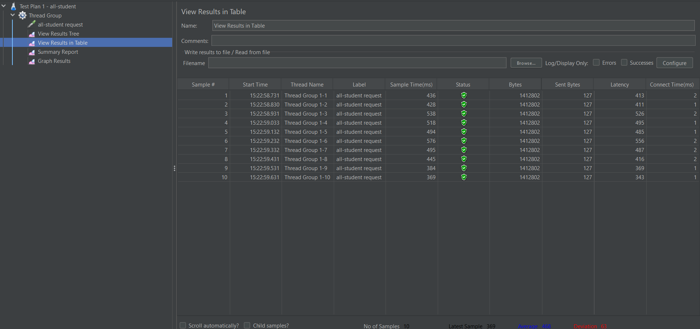
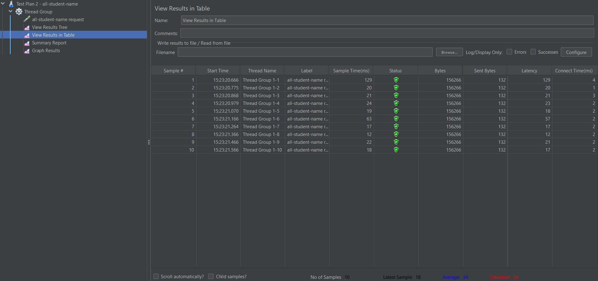

# Modul 7 Profiling

Repository ini sudah disiapkan untuk pengujian :

- `/all-student`
- `/all-student-name`
- `/highest-gpa`

Konfigurasi test plan :

- `10` virtual users
- ramp-up `1` second
- loop count `1`
- listener : `View Results Tree`, `View Results in Table`, `Summary Report`, `Graph Results`

## Seed Data

Endpoint seed yang dijalankan:

- `GET /seed-data-master`
- `GET /seed-student-course`

Jumlah data yang terdeteksi saat pengujian:

- `students = 5000`
- `courses = 10`
- `student_courses = 20000`

## Lokasi File

- Test plan 1: [jmeter/test_plan_1.jmx](/C:/Adpro/advprog-modul7-profiling/jmeter/test_plan_1.jmx)
- Test plan 2: [jmeter/test_plan_2.jmx](/C:/Adpro/advprog-modul7-profiling/jmeter/test_plan_2.jmx)
- Test plan 3: [jmeter/test_plan_3.jmx](/C:/Adpro/advprog-modul7-profiling/jmeter/test_plan_3.jmx)

## Menjalankan Pengujian

Jalankan aplikasi Spring Boot terlebih dulu di `localhost:8080`, lalu eksekusi:


```powershell
.\apache-jmeter-5.6.3\apache-jmeter-5.6.3\bin\jmeter.bat -n -t .\jmeter\test_plan_1.jmx -l .\jmeter\results\test_plan_1.jtl
.\apache-jmeter-5.6.3\apache-jmeter-5.6.3\bin\jmeter.bat -n -t .\jmeter\test_plan_2.jmx -l .\jmeter\results\test_plan_2.jtl
.\apache-jmeter-5.6.3\apache-jmeter-5.6.3\bin\jmeter.bat -n -t .\jmeter\test_plan_3.jmx -l .\jmeter\results\test_plan_3.jtl
```

## Hasil

### Profiling Summary

Berdasarkan hasil profiling, bottleneck utama ada pada `StudentService.getAllStudentsWithCourses()`.

Masalah utamanya:

 hasil profiling ada pada cara aplikasi mengakses dan memproses data di ketiga endpoint. Pada endpoint `/all-student`, aplikasi mengalami pola N+1 query karena sistem terlebih dahulu mengambil seluruh data student, lalu untuk setiap student menjalankan `findByStudentId(...)` secara terpisah untuk mengambil data course. Lalu, Pada endpoint `/highest-gpa`, aplikasi masih mengambil seluruh data student ke memory lebih dulu, kemudian mencari nilai GPA tertinggi melalui iterasi di application base. Sementara itu, pada endpoint `/all-student-name`, penggabungan nama masih dilakukan menggunakan konkatenasi string berulang, yang kurang efisien ketika jumlah data semakin besar.

Optimasi yang diterapkan:

difokuskan untuk memindahkan beban kerja yang tidak perlu dari application ke database serta mengurangi jumlah query. Pada endpoint `/all-student`, proses pengambilan data diubah menjadi satu query repository menggunakan `@EntityGraph` agar data student dan course bisa diambil sekaligus tanpa query tambahan per student. Pada endpoint `/highest-gpa`, pencarian mahasiswa dengan GPA tertinggi dipindahkan ke query database melalui `findTopByOrderByGpaDesc()`, sehingga aplikasi tidak lagi perlu memproses seluruh data secara manual di memory. Pada endpoint `/all-student-name`, penggabungan nama mahasiswa dipindahkan ke PostgreSQL menggunakan fungsi `string_agg()`, sehingga proses dilakukan langsung di database dengan lebih efisien.

### Initial JMeter Measurement

Hasil sebelum optimasi `http://localhost:8080`:

| Test Plan | Endpoint | Samples | Avg (ms) | Median (ms) | Min (ms) | Max (ms) | Throughput (req/s) | Errors |
| --- | --- | ---: | ---: | ---: | ---: | ---: | ---: | ---: |
| `test_plan_1` | `/all-student` | 10 | 41572.6 | 41735.5 | 40663.0 | 42012.0 | 0.23 | 0 |
| `test_plan_2` | `/all-student-name` | 10 | 815.8 | 708.5 | 570.0 | 1214.0 | 5.69 | 0 |
| `test_plan_3` | `/highest-gpa` | 10 | 603.7 | 594.0 | 505.0 | 660.0 | 15.13 | 0 |

### JMeter Measurement After Optimization

Hasil setelah optimasi dan warm-up ulang:

| Test Plan | Endpoint | Samples | Avg (ms) | Median (ms) | Min (ms) | Max (ms) | Throughput (req/s) | Errors |
| --- | --- | ---: | ---: | ---: | ---: | ---: | ---: | ---: |
| `test_plan_1` | `/all-student` | 10 | 989.9 | 1034.5 | 786.0 | 1100.0 | 6.46 | 0 |
| `test_plan_2` | `/all-student-name` | 10 | 75.6 | 34.5 | 20.0 | 161.0 | 15.27 | 0 |
| `test_plan_3` | `/highest-gpa` | 10 | 236.1 | 275.5 | 24.0 | 394.0 | 16.50 | 0 |

### Comparison

Perbandingan rata-rata waktu respons:

| Endpoint | Before Avg (ms) | After Avg (ms) | Improvement |
| --- | ---: | ---: | ---: |
| `/all-student` | 41572.6 | 989.9 | 97.62% |
| `/all-student-name` | 815.8 | 75.6 | 90.73% |
| `/highest-gpa` | 603.7 | 236.1 | 60.89% |

### Conclusion

Ada improvement yang signifikan dari hasil JMeter setelah optimasi.

- Endpoint `/all-student` mengalami perbaikan terbesar karena bottleneck `N+1 query` berhasil dihilangkan.
- Endpoint `/all-student-name` juga membaik drastis karena operasi penggabungan string dipindahkan ke database.
- Endpoint `/highest-gpa` membaik karena proses pencarian nilai tertinggi tidak lagi dilakukan dengan iterasi penuh di application layer.
- Semua endpoint melampaui target minimal `20%` improvement.

Screenshot hasil:

### Test Plan 1 - `/all-student`


### Test Optimized Plan 1 - `/all-student`




### Test Plan 2 - `/all-student-name`


### Test Optimized Plan 2 - `/all-student-name`




### Test Plan 3 - `/highest-gpa`


### Test Optimized Plan 3 - `/highest-gpa`


## Reflection

### 1. What is the difference between the approach of performance testing with JMeter and profiling with IntelliJ Profiler in the context of optimizing application performance?

JMeter digunakan untuk mengukur performa aplikasi dari sisi eksternal, misalnya waktu respons, throughput, dan endpoint saat menerima banyak request. Dengan kata lain, JMeter membantu melihat gejala performa dari sudut pandang client. Sementara itu, IntelliJ Profiler digunakan untuk melihat apa yang terjadi di dalam aplikasi ketika request diproses, seperti method mana yang paling banyak memakan CPU time, call stack, dan bottleneck pada level kode dalam sudut pandang server. Dalam konteks ini, JMeter membantu membuktikan bahwa memang ada masalah performa, sedangkan profiler membantu menemukan penyebab teknis dari masalah tersebut.

### 2. How does the profiling process help you in identifying and understanding the weak points in your application?

Proses profiling membantu karena memberikan informasi yang lebih detail daripada sekadar angka response time. Dari profiling, saya bisa melihat method mana yang paling sering aktif, method mana yang menghabiskan CPU time terbesar, dan alur eksekusi mana yang paling mahal. Dengan begitu, saya tidak perlu menebak-nebak penyebab lambatnya aplikasi. Pada kasus ini, profiling membantu menunjukkan bahwa bottleneck utama ada di `getAllStudentsWithCourses()`.

### 3. Do you think IntelliJ Profiler is effective in assisting you to analyze and identify bottlenecks in your application code?

Ya, IntelliJ Profiler efektif untuk membantu menganalisis bottleneck karena hasilnya cukup visual dan mudah dihubungkan langsung ke source code. Flame graph, call tree, timeline, dan method list sangat membantu untuk memahami bagian mana yang benar-benar mahal saat aplikasi berjalan. Profiler juga mempercepat proses investigasi karena saya bisa melihat apakah masalah ada pada CPU usage, pola pemanggilan method, atau operasi tertentu yang terlalu sering terjadi. Untuk tugas seperti ini, profiler sangat berguna karena tidak hanya menunjukkan bahwa aplikasi lambat, tetapi juga memperlihatkan lokasi masalahnya.

### 4. What are the main challenges you face when conducting performance testing and profiling, and how do you overcome these challenges?

Tantangan utama saat melakukan performance testing dan profiling adalah hasil pengukuran bisa berubah-ubah tergantung kondisi lingkungan, seperti warm-up JVM, cache, kondisi database, dan beban mesin saat itu. Tantangan lain adalah membedakan antara gejala dan akar masalah, karena response time yang tinggi belum tentu langsung menunjukkan method penyebabnya. Untuk mengatasinya, saya melakukan warm-up sebelum pengukuran, membandingkan hasil sebelum dan sesudah optimasi dengan skenario JMeter yang sama, serta menggunakan profiler untuk memverifikasi method yang benar-benar menjadi bottleneck. Dengan pendekatan itu, hasil analisis menjadi lebih konsisten.

### 5. What are the main benefits you gain from using IntelliJ Profiler for profiling your application code?

Manfaat utama dari IntelliJ Profiler adalah, saya bisa melihat perilaku runtime aplikasi secara lebih nyata. Saya mendapatkan insight tentang method yang paling mahal, pola eksekusi berulang, dan bagian kode mana yang sebaiknya diprioritaskan untuk dioptimalkan. Profiler juga membantu menghemat waktu karena saya tidak perlu mencoba optimasi secara acak. 

### 6. How do you handle situations where the results from profiling with IntelliJ Profiler are not entirely consistent with findings from performance testing using JMeter?

Jika hasil profiler dan JMeter tidak sepenuhnya konsisten, saya melihat keduanya sebagai dua jenis sudut pandang yang berbeda. JMeter menunjukkan performa dari luar aplikasi, sedangkan profiler menunjukkan apa yang sedang terjadi di dalam aplikasi. Jadi, saya biasanya memeriksa ulang skenario pengujian, memastikan endpoint yang diuji sama, melakukan warm-up ulang, dan menjalankan pengukuran beberapa kali agar hasilnya lebih stabil. 

### 7. What strategies do you implement in optimizing application code after analyzing results from performance testing and profiling? How do you ensure the changes you make do not affect the application's functionality?

Strategi optimasi yang saya lakukan adalah memprioritaskan bottleneck terbesar terlebih dahulu, lalu memilih perbaikan yang paling berdampak dengan perubahan kode yang tetap terkontrol. Pada tugas ini, strategi tersebut diwujudkan dengan mengurangi jumlah query, memindahkan agregasi data ke database, dan menghindari proses yang tidak efisien di application layer. Untuk memastikan fungsi aplikasi tidak rusak, saya membandingkan hasil endpoint sebelum dan sesudah optimasi, menjalankan test aplikasi, dan melakukan pengukuran ulang dengan JMeter untuk memastikan performa benar-benar membaik tanpa mengubah tujuan endpoint. Dengan cara itu, optimasi tidak hanya cepat, tetapi juga tetap aman secara fungsional.
