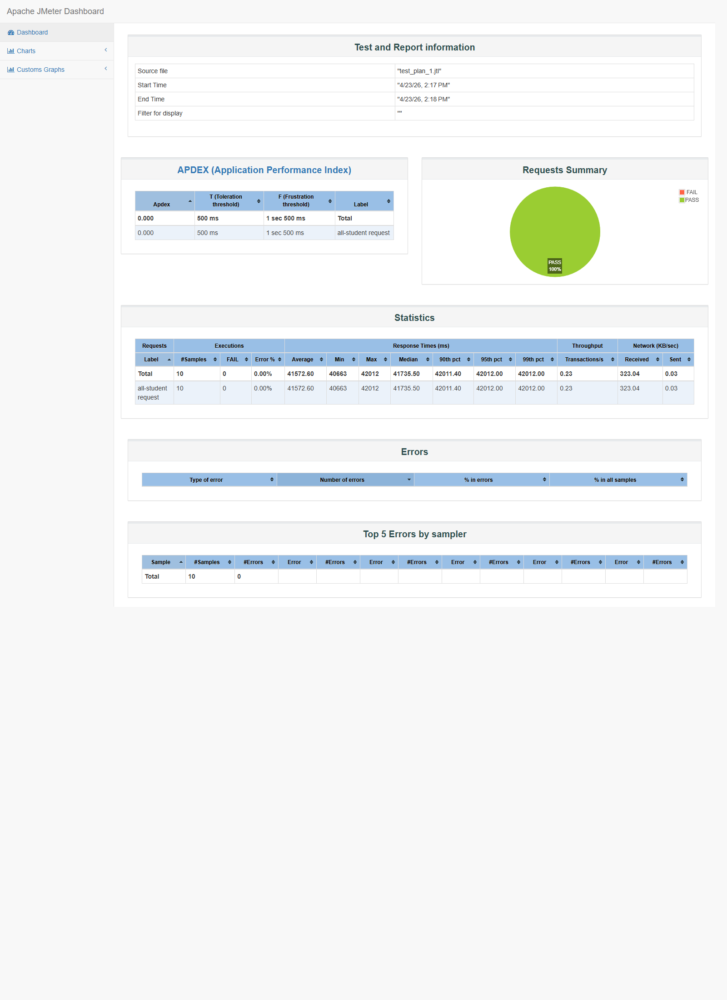
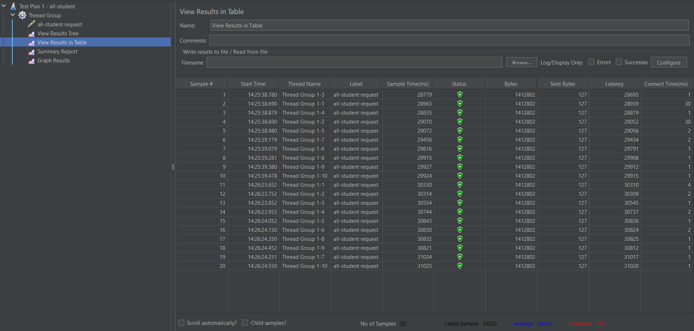
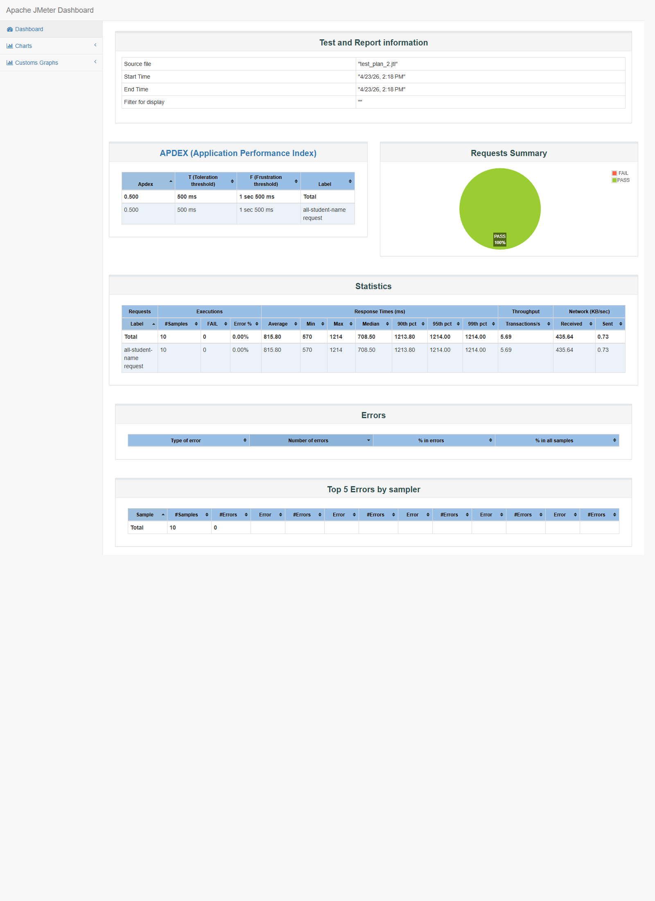
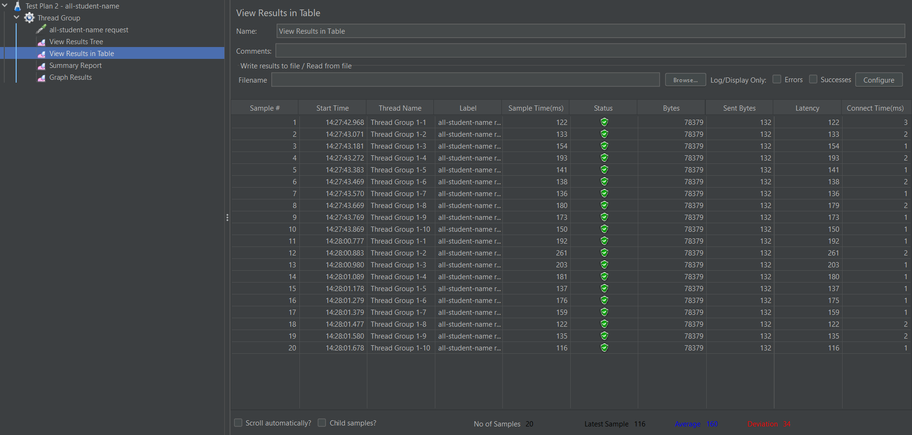
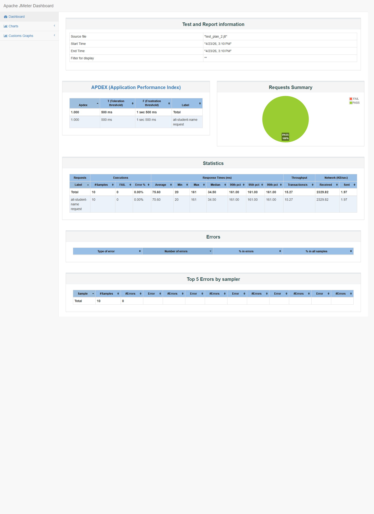
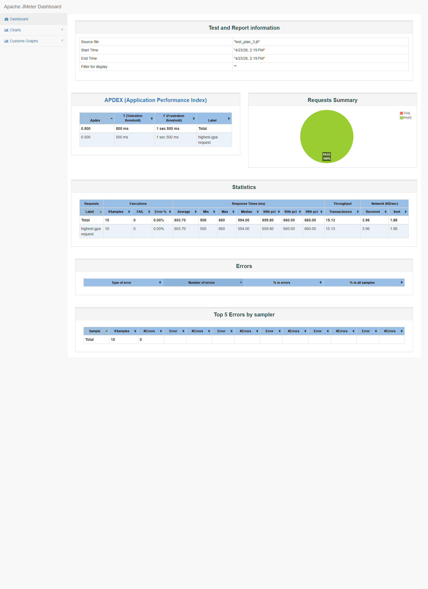
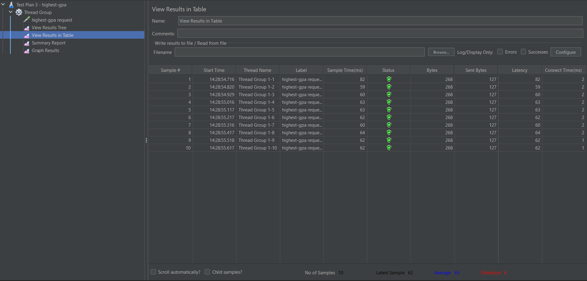

# JMeter Performance Testing

Repository ini sudah disiapkan untuk pengujian tiga endpoint berikut dengan Apache JMeter 5.6.3:

- `/all-student`
- `/all-student-name`
- `/highest-gpa`

Konfigurasi test plan mengikuti instruksi pada gambar tugas:

- `10` virtual users
- ramp-up `1` second
- loop count `1`
- listener yang disertakan di setiap plan: `View Results Tree`, `View Results in Table`, `Summary Report`, `Graph Results`

## Seed Data

Database yang dipakai adalah `advpro-2024` pada PostgreSQL lokal.

Endpoint seed yang diasumsikan sudah dijalankan:

- `GET /seed-data-master`
- `GET /seed-student-course`

Jumlah data yang terdeteksi saat pengujian:

- `students = 5000`
- `courses = 10`
- `student_courses = 20000`

## Lokasi File

- Test plan 1: [jmeter/test_plan_1.jmx](/C:/Adpro/advprog-modul7-profiling/jmeter/test_plan_1.jmx)
- Test plan 2: [jmeter/test_plan_2.jmx](/C:/Adpro/advprog-modul7-profiling/jmeter/test_plan_2.jmx)
- Test plan 3: [jmeter/test_plan_3.jmx](/C:/Adpro/advprog-modul7-profiling/jmeter/test_plan_3.jmx)
- Runner script: [jmeter/run-jmeter-tests.ps1](/C:/Adpro/advprog-modul7-profiling/jmeter/run-jmeter-tests.ps1)

## Menjalankan Pengujian

Jalankan aplikasi Spring Boot terlebih dulu di `localhost:8080`, lalu eksekusi:


```powershell
.\apache-jmeter-5.6.3\apache-jmeter-5.6.3\bin\jmeter.bat -n -t .\jmeter\test_plan_1.jmx -l .\jmeter\results\test_plan_1.jtl
.\apache-jmeter-5.6.3\apache-jmeter-5.6.3\bin\jmeter.bat -n -t .\jmeter\test_plan_2.jmx -l .\jmeter\results\test_plan_2.jtl
.\apache-jmeter-5.6.3\apache-jmeter-5.6.3\bin\jmeter.bat -n -t .\jmeter\test_plan_3.jmx -l .\jmeter\results\test_plan_3.jtl
```

## Hasil

### Profiling Summary

Berdasarkan hasil profiling, bottleneck utama ada pada `StudentService.getAllStudentsWithCourses()`.

Masalah utamanya:

- terjadi pola `N+1 query` karena aplikasi mengambil semua student lalu memanggil `findByStudentId(...)` untuk setiap student
- `/highest-gpa` masih mengambil semua student lalu mencari nilai maksimum di memory
- `/all-student-name` masih menggunakan konkatenasi string berulang yang tidak efisien

Optimasi yang diterapkan:

- `/all-student`: diganti menjadi satu query repository dengan `@EntityGraph` untuk mengambil `student` dan `course` sekaligus
- `/highest-gpa`: pencarian mahasiswa dengan GPA tertinggi dipindahkan ke query database `findTopByOrderByGpaDesc()`
- `/all-student-name`: penggabungan nama dipindahkan ke query PostgreSQL `string_agg(...)`

### Initial JMeter Measurement

Hasil sebelum optimasi pada `http://localhost:8080`:

| Test Plan | Endpoint | Samples | Avg (ms) | Median (ms) | Min (ms) | Max (ms) | Throughput (req/s) | Errors |
| --- | --- | ---: | ---: | ---: | ---: | ---: | ---: | ---: |
| `test_plan_1` | `/all-student` | 10 | 41572.6 | 41735.5 | 40663.0 | 42012.0 | 0.23 | 0 |
| `test_plan_2` | `/all-student-name` | 10 | 815.8 | 708.5 | 570.0 | 1214.0 | 5.69 | 0 |
| `test_plan_3` | `/highest-gpa` | 10 | 603.7 | 594.0 | 505.0 | 660.0 | 15.13 | 0 |

### JMeter Measurement After Optimization

Hasil setelah optimasi dan warm-up ulang:

| Test Plan | Endpoint | Samples | Avg (ms) | Median (ms) | Min (ms) | Max (ms) | Throughput (req/s) | Errors |
| --- | --- | ---: | ---: | ---: | ---: | ---: | ---: | ---: |
| `test_plan_1` | `/all-student` | 10 | 989.9 | 1034.5 | 786.0 | 1100.0 | 6.46 | 0 |
| `test_plan_2` | `/all-student-name` | 10 | 75.6 | 34.5 | 20.0 | 161.0 | 15.27 | 0 |
| `test_plan_3` | `/highest-gpa` | 10 | 236.1 | 275.5 | 24.0 | 394.0 | 16.50 | 0 |

### Comparison

Perbandingan rata-rata waktu respons:

| Endpoint | Before Avg (ms) | After Avg (ms) | Improvement |
| --- | ---: | ---: | ---: |
| `/all-student` | 41572.6 | 989.9 | 97.62% |
| `/all-student-name` | 815.8 | 75.6 | 90.73% |
| `/highest-gpa` | 603.7 | 236.1 | 60.89% |

### Conclusion

Ada improvement yang signifikan dari hasil JMeter setelah optimasi.

- Endpoint `/all-student` mengalami perbaikan terbesar karena bottleneck `N+1 query` berhasil dihilangkan.
- Endpoint `/all-student-name` juga membaik drastis karena operasi penggabungan string dipindahkan ke database.
- Endpoint `/highest-gpa` membaik karena proses pencarian nilai tertinggi tidak lagi dilakukan dengan iterasi penuh di application layer.
- Semua endpoint melampaui target minimal `20%` improvement.

Screenshot hasil:

### Test Plan 1 - `/all-student`





### Test Plan 2 - `/all-student-name`





### Test Plan 3 - `/highest-gpa`




